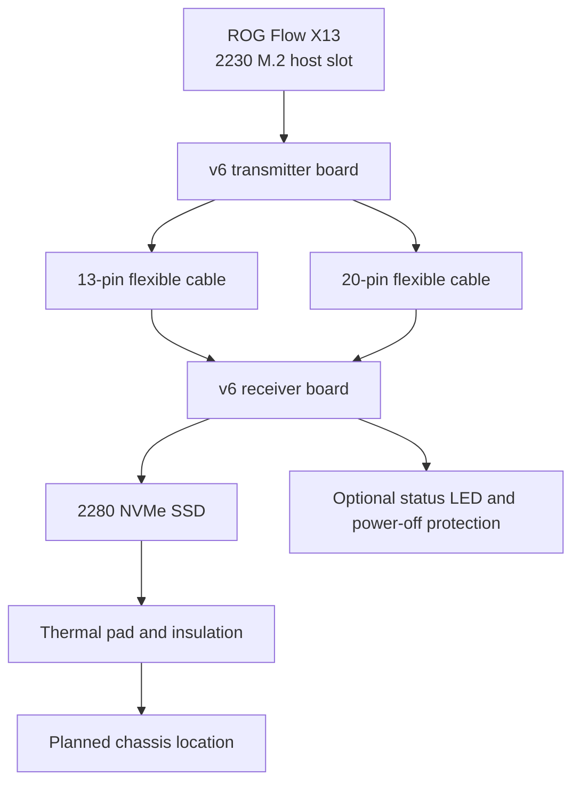

  
  <h1>ROG Flow X13 2230 → 2280 SSD Dual-Board Adapter</h1>
  
<strong>Extend the internal 2230 M.2 slot to a full-size 2280 NVMe SSD</strong>

  
Hardware v6 · Dual-board architecture · Altium sources · Manufacturing outputs · 3D packages · Historical installation guide

  

    
    
    
    
    
  

  
<a href="README.md">简体中文</a> · <a href="#3-package-map">Package map</a> · <a href="#7-installation-checklist">Installation</a>

> [!CAUTION]
> This modification requires laptop disassembly, battery isolation, electrostatic-discharge control, soldering, insulation, and enclosure changes, and a mistake may damage the motherboard, SSD, cables, or chassis and may affect the warranty

## 1 Overview

This repository contains a two-board hardware adapter for extending the ROG Flow X13 2230 M.2 slot to a full-size 2280 NVMe SSD

The transmitter board plugs into the host-side 2230 slot, while the receiver board carries the 2280 SSD, with one 13-pin and one 20-pin flexible cable linking the two boards [1], [2]

The repository includes v6 Altium sources, Gerber and drill outputs, six SolidWorks package models, and a historical Chinese installation guide

Table 1.1 Current evidence status

| Area | Current state | Reading guidance |
| --- | --- | --- |
| Hardware sources | v6 transmitter and v6 receiver | These are the newest complete hardware sources in the repository |
| Manufacturing files | Two Gerber, drill, and report packages | The transmitter has 25 files and the receiver has 27 files |
| Installation guide | Title says v4 and its body references v3 archives | Use it for historical BOM and installation context, not as a complete v6 change log |
| Historical tests | A 2021 Flow X13 and one B550M platform | Performance and temperature claims were not rerun for this README update |
| Automation | No GitHub Actions | Hardware sources and outputs require manual review |
| License | No repository license file | Public visibility does not automatically grant reproduction, fabrication, or redistribution rights |

  
   
  Figure 1.1 Dual-board adapter and flexible cables from the historical guide [1]

## 2 System architecture

Figure 2.1 Dual-board connection path

The guide lists one 13-pin and one 20-pin cable, while its title also contains the term “34pin”, so cable counts, schematic pins, pads, and physical connectors must be checked against the v6 design before ordering [1], [2]

## 3 Package map

Table 3.1 Repository deliverables

| Path | Contents | Intended use |
| --- | --- | --- |
| [`2230-2280转接板 屏蔽v6 发射端`](<2230-2280转接板 屏蔽v6 发射端>) | Transmitter Altium project and 25 manufacturing files | Host-side board editing and fabrication |
| [`2230-2280转接板 屏蔽v6 接收端`](<2230-2280转接板 屏蔽v6 接收端>) | Receiver Altium project, DRC report, and 27 manufacturing files | SSD-side board editing and fabrication |
| [`3D封装`](3D封装) | Six SolidWorks part models | Mechanical package references |
| [`幻13 固态转接板 使用说明.docx`](<幻13 固态转接板 使用说明.docx>) | Historical BOM, tests, fabrication, soldering, and installation notes | Design-intent and prototype reference |
| [`docs/readme-audit.md`](docs/readme-audit.md) | Source audit, redaction record, and validation limits | Review of this README upgrade |

## 4 Fabrication baseline

The historical guide specifies a two-layer design, recommends 0.8 mm for the transmitter and 0.6 or 0.8 mm for the receiver, and prefers ENIG over the tin finish used by the prototype [1]

The required historical BOM consists of eight 0201 220 nF capacitors, one LOTES 67-pin 2.3H M-Key connector, one 8 cm 13-pin cable, and one 8 cm 20-pin cable

The optional indicator and power-off protection network uses one 7343 220 µF tantalum capacitor, 1 kΩ and 4.7 kΩ 0603 resistors, a green 0603 LED, and an AO3400 SOT-23 transistor

The repository does not specify a currently approved stack-up, impedance target, copper weight, fabrication tolerance, or cable rating, so a fabrication and signal-integrity review is required before production

Table 4.1 Historical board parameters

| Parameter | Transmitter | Receiver | Note |
| --- | --- | --- | --- |
| Layer count | 2 | 2 | From the historical guide [1] |
| Recommended thickness | 0.8 mm | 0.6 mm or 0.8 mm | The prototype record says both boards used 0.8 mm |
| Surface finish | ENIG preferred | ENIG preferred | The prototype used tin finish, while the guide recommends ENIG |
| Board envelope | The guide says within `10 × 10` | The guide says within `10 × 10` | The source omits the unit, so verify from Gerber data before ordering |
| Outputs | Gerber, drill, rules, and test-point files | Gerber, drill, DRC, rules, and test-point files | Both packages were generated in 2022 |

## 5 Bill of materials

Table 5.1 Required historical BOM

| Category | Specification | Quantity | Purpose |
| --- | --- | ---: | --- |
| Decoupling capacitor | 0201, 220 nF | 8 | Required count in the historical guide |
| M.2 connector | LOTES NGFF 67-pin, 2.3H, M-Key 4+5 | 1 | Carries the 2280 SSD on the receiver board |
| Flexible cable | ADT 13-pin, 8 cm | 1 | One of the two board links |
| Flexible cable | ADT 20-pin, 8 cm | 1 | One of the two board links |

Table 5.2 Optional indicator and protection parts

| Part | Specification | Quantity | Condition |
| --- | --- | ---: | --- |
| Tantalum capacitor | 7343, 220 µF, about 1.8 mm high | 1 | Historical power-buffering option |
| Resistor | 0603, 1 kΩ | 1 | Indicator or protection network |
| Resistor | 0603, 4.7 kΩ | 1 | Indicator or protection network |
| LED | 0603, green | 1 | Optional status indication |
| Transistor | AO3400, SOT-23 | 1 | Optional power-off protection |
| Insulation and shielding | Acetate cloth tape and shielding tape | As required | Historical stack is insulation, shielding, insulation |

Part names come from the historical guide, while reference designators, polarity, voltage rating, current rating, and package orientation must be checked against the v6 schematic and PCB [1], [2]

## 6 Historical test evidence

The guide records tests on a 2021 ROG Flow X13 limited to PCIe 3.0 ×4 and on a B550M platform capable of hosting PCIe 4.0 ×4 SSDs

The tested system-drive samples were a 256 GB PM981a, 512 GB Kioxia XG7, 2 TB PM9A1, and the original 1 TB SN530

Table 6.1 Historical test platforms

| Platform | Main configuration | Interface limit | Purpose |
| --- | --- | --- | --- |
| ROG Flow X13 2021 | Ryzen 9 5900HS and GeForce RTX 3050 Ti | PCIe 3.0 ×4 | Internal installation and system-drive test |
| B550M desktop | Ryzen 3 3100, 8 GB DDR4-3200, and GT 610 2 GB | Supports PCIe 4.0 ×4 SSDs | External adapter validation |

Table 6.2 System-drive samples recorded by the guide

| SSD | Capacity | Interface | Recorded result |
| --- | ---: | --- | --- |
| Samsung PM981a | 256 GB | 2280, PCIe 3.0 ×4 | Tested as a system drive |
| Kioxia XG7 | 512 GB | 2280, PCIe 4.0 ×4 | Tested as a system drive |
| Samsung PM9A1 | 2 TB | 2280, PCIe 4.0 ×4, marked 2.8 A | Tested as a system drive |
| Western Digital SN530 | 1 TB | 2230, PCIe 3.0 ×4 | Original Flow X13 drive used as a reference |

The guide reports roughly 90% of direct-install performance under its PCIe 3.0 setup, sustained temperatures of about 50–70 °C, and an approximately 10 °C reduction with a thermal pad [1]

These are historical prototype claims without raw benchmark data, a reproducible test script, repeated runs, or uncertainty estimates, and they are not a performance guarantee

## 7 Installation checklist

- First, back up all data, shut the system down, unplug the charger, and work in an electrostatic-discharge-controlled area

- Second, ground yourself, disconnect the battery, and keep metal tools away from exposed motherboard contacts

- Third, assemble and inspect both boards, both cables, and the SSD outside the chassis, checking cable orientation and VCC-to-GND shorts

- Fourth, perform a minimal recognition and read/write test before planning the internal cable route

- Fifth, add heat-resistant insulation, keep conductive shielding away from exposed contacts, and use a suitable thermal pad where required

- Sixth, verify that the cover does not continuously compress the cables, connectors, or components, then retest recognition, thermals, sleep and wake, and sustained I/O

  <table>
    <tr>
      <td align="center"></td>
      <td align="center"></td>
    </tr>
    <tr><td align="center">Internal installation</td><td align="center">Prototype cover profile</td></tr>
  </table>
  Figure 7.1 Historical prototype installation [1]

The historical installation cuts plastic protrusions inside the cover, may prevent use of the center screw, and produced a slight cover bulge on the prototype, so mechanical and warranty risks must be assessed before modification

## 8 Soldering requirements

The guide recommends low- or medium-temperature solder, a small hoof or pointed iron tip, RELIFE-422 flux, and focused inspection of the fine-pitch connectors, cold joints, and VCC-to-GND shorts [1]

Its soldering-temperature recommendation is written as `300s`, which may be a unit typo or another recording error, and the repository does not provide enough evidence to reinterpret it as `300 °C`

The historical shielding stack is acetate-cloth insulation, conductive shielding tape, and another acetate-cloth insulation layer, and no conductive shielding material should touch exposed pads, connectors, or motherboard components

## 9 Validation status

Table 9.1 Verifiable evidence

| Check | Repository evidence | Current conclusion |
| --- | --- | --- |
| Receiver design-rule check | DRC report dated June 9, 2022 [3] | Zero rule violations and one warning at the CN2-59 GND pad |
| Transmitter outputs | Gerber and test-point package dated August 8, 2022 [4] | 25 output files, without a matching DRC report |
| Receiver outputs | Gerber, drill, DRC, and test-point package dated June 9, 2022 [5] | 27 output files |
| Guide structure | 97 paragraphs and 11 image relationships | Authorship, revision-session data, and personal contacts were sanitized |
| Visual document review | LibreOffice unavailable in this environment | Structural fallback checks passed, but page rendering was not reviewed |
| Automated hardware tests | No CI, netlist comparison, or output regeneration workflow | Regenerate and inspect all outputs after any design change |

The receiver DRC report dated June 9, 2022 records zero rule violations and one warning for an unplated multi-layer GND pad at CN2-59 [3]

The transmitter package contains 25 manufacturing files but no matching DRC report, while the receiver package contains 27 files including DRC output [4], [5]

The guide is labeled v4 and still references v3 archive names, whereas the hardware projects and manufacturing outputs are v6, so the guide must be treated as historical context rather than a complete v6 change specification

The guide also contains the string `300s` as a soldering-temperature recommendation, which is ambiguous and has deliberately not been reinterpreted as `300 °C`

There is no automated CI, netlist comparison, manufacturing regeneration workflow, or explicit repository license

## 10 Version status

Table 10.1 Version clues

| Location | Version clue | Interpretation |
| --- | --- | --- |
| Transmitter and receiver project folders | v6 | Current hardware baseline |
| Manufacturing outputs | v6 in filenames | Retained with the current projects |
| Word guide title | v4 | Historical installation context, not a full v6 change specification |
| Word guide body | References v3 manufacturing archives | Stale ordering guidance retained for context |
| Cable count | 13-pin plus 20-pin, while the title says 34pin | Verify every pin before ordering |

The repository has no schematic change log, v4-to-v6 comparison, board-house order parameters, firmware, software driver, or reproducible benchmark dataset

## 11 Privacy and document status

The public files have been sanitized for document authorship metadata, revision-session identifiers, personal contact numbers, temporary workstation paths, and deterministic local path prefixes in Altium-related files

The two manufacturing archives were rebuilt from their expanded directories, preserving 25 and 27 files while applying the same redactions and correcting legacy filename encoding

LibreOffice was unavailable in the validation environment, so the Word guide passed structural, relationship, metadata, archive-integrity, and sensitive-string checks but not a page-by-page render review

## 12 References

[1] AIALRA, “幻13 固态转接板 使用说明,” Word document, Mar. 2023. [Online]. Available: [`幻13 固态转接板 使用说明.docx`](<幻13 固态转接板 使用说明.docx>)

[2] AIALRA, “ROG Flow X13 2230–2280 SSD converter, v6 Altium sources,” 2022. [Online]. Available: [`Transmitter`](<2230-2280转接板 屏蔽v6 发射端>) and [`Receiver`](<2230-2280转接板 屏蔽v6 接收端>)

[3] AIALRA, “Design Rule Check — Receiver V6,” Jun. 9, 2022. [Online]. Available: [`Design Rule Check - 接收端V6.drc`](<2230-2280转接板 屏蔽v6 接收端/Project Outputs for 2230-2280转接板 屏蔽v6 接收端/Design Rule Check - 接收端V6.drc>)

[4] AIALRA, “Project Outputs for the v6 transmitter,” Aug. 8, 2022. [Online]. Available: [`Transmitter manufacturing outputs`](<2230-2280转接板 屏蔽v6 发射端/Project Outputs for 2230-2280转接板 屏蔽v6 发射端>)

[5] AIALRA, “Project Outputs for the v6 receiver,” Jun. 9, 2022. [Online]. Available: [`Receiver manufacturing outputs`](<2230-2280转接板 屏蔽v6 接收端/Project Outputs for 2230-2280转接板 屏蔽v6 接收端>)

---

Hardware files are provided without an explicit license · Review electrical, mechanical, thermal, and legal constraints before use

