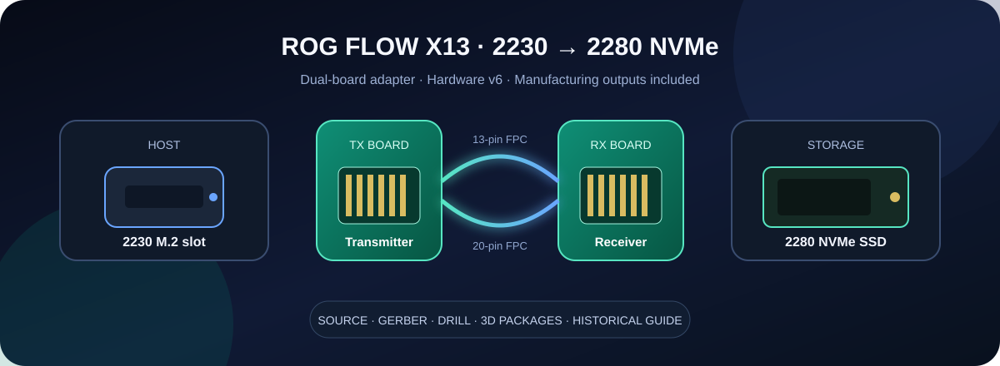
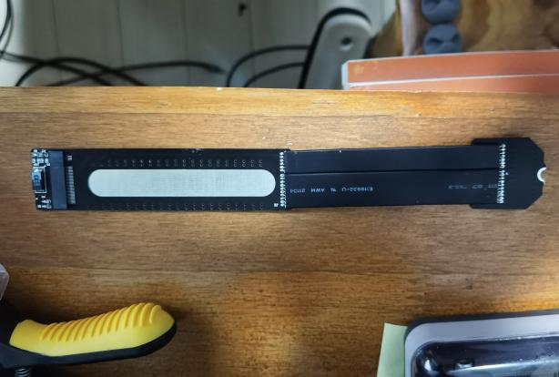
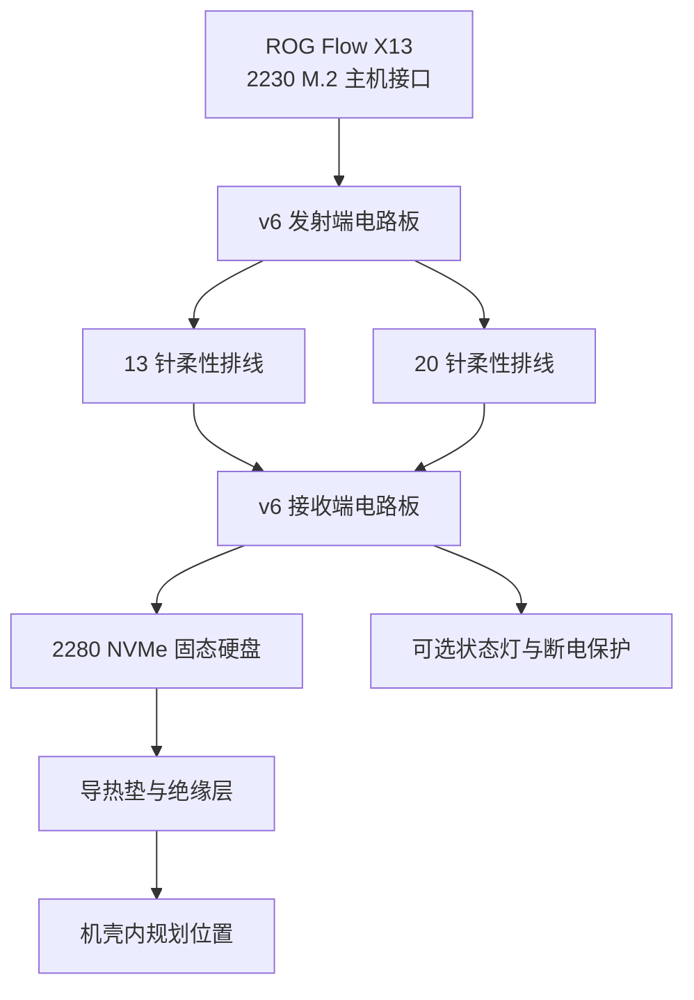
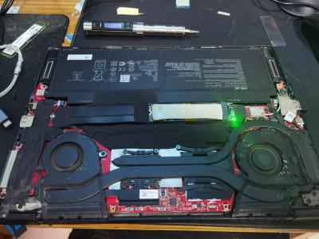
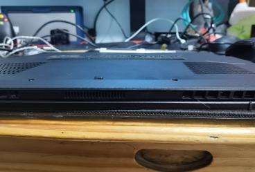

  
  
以下硬件规格依据仓库设计资料与历史说明 [1], [2]

  <h1>ROG Flow X13 2230 → 2280 SSD 双板转接器 [1], [2]</h1>
  
<strong>把机内 2230 M.2 接口延伸到全尺寸 2280 NVMe 固态硬盘 [1], [2]</strong>

  
硬件 v6 · 双板与双排线架构 · Altium 源文件 · 制造输出 · 三维封装 · 历史安装说明 [1], [2]

  

    
    
    
    
    
  

  

    <a href="#1-项目概览">项目概览</a> · <!-- [1], [2] -->
    <a href="#3-仓库内容">仓库内容</a> · <!-- [1], [2] -->
    <a href="#5-物料清单">物料清单</a> · <!-- [1], [2] -->
    <a href="#7-安装流程">安装流程</a> · <!-- [1], [2] -->
    <a href="README.en.md">English</a> <!-- [1], [2] -->
  

> [!CAUTION]
> 这是需要拆机、断电、静电防护、焊接和机壳改造的硬件实验，操作失误可能损坏主板、固态硬盘、排线或外壳，也可能影响设备保修，仓库资料不能替代电气安全检查和制造商评审

## 1 项目概览

ROG Flow X13 的机内空间主要面向 2230 规格固态硬盘，本项目用两块电路板和两条柔性排线延伸 PCI Express 通道，让 2280 规格 NVMe 固态硬盘能够放置在机内另一位置 [1], [2]

发射端连接主机侧 2230 M.2 插槽，接收端承载 2280 固态硬盘

两块电路板通过 13 针和 20 针排线连接，这一角色划分依据工程命名、使用说明和实拍安装图综合确认 [1], [2]

表 1.1 当前资料状态

| 项目 | 当前状态 | 阅读提示 |
| --- | --- | --- |
| 硬件工程 | v6 发射端与 v6 接收端 | 这是仓库中最新且完整的设计源文件 |
| 制造文件 | 两套 Gerber、钻孔和辅助报告 | 发射端 25 个文件，接收端 27 个文件 |
| 使用说明 | 标题仍标记 v4，正文还出现 v3 压缩包名 | 物料与安装经验可参考，版本名称不能当作 v6 变更说明 |
| 历史测试 | 2021 款 Flow X13 与一套 B550M 平台 | 性能和温度属于历史样机记录，未在当前提交重新测试 |
| 自动化检查 | 没有 GitHub Actions | 硬件源文件和制造文件需要人工复核 |
| 授权状态 | 仓库没有许可证文件 | 公开可见不代表自动获得复制、生产或再分发许可 |

  
   
  图 1.1 双板转接器与柔性排线实拍，图片来自仓库内历史使用说明 [1]

## 2 系统结构

图 2.1 双板转接器的连接关系

历史说明把两条排线写为 13 针和 20 针，文档标题同时写有“34pin”，两处计数并不一致 [1]

下单前应以 v6 原理图、焊盘编号和实物连接器逐项核对 [2]

## 3 仓库内容

表 3.1 交付物导航

| 目录或文件 | 包含内容 | 适用场景 |
| --- | --- | --- |
| [`2230-2280转接板 屏蔽v6 发射端`](<2230-2280转接板 屏蔽v6 发射端>) | Altium 工程、原理图、PCB、封装库与 25 个制造输出 | 主机侧电路板编辑与生产 |
| [`2230-2280转接板 屏蔽v6 接收端`](<2230-2280转接板 屏蔽v6 接收端>) | Altium 工程、原理图、PCB、封装库、设计规则报告与 27 个制造输出 | 固态硬盘侧电路板编辑与生产 |
| [`3D封装`](3D封装) | 6 个 SolidWorks 零件文件 | 0201、0603、7343、SOT-23、NGFF 连接器等机械参考 |
| [`幻13 固态转接板 使用说明.docx`](<幻13 固态转接板 使用说明.docx>) | 物料、历史测试、打样、焊接和安装记录 | 理解设计意图与样机经验 |
| [`docs/readme-audit.md`](docs/readme-audit.md) | 资料来源、隐私清理和验证边界 | 审核本次首页升级 |
| [`docs/legacy/README.original.md`](docs/legacy/README.original.md) | 升级前的原始首页 | 追溯原始描述 |

制造压缩包与展开目录同时保留，压缩包便于下载，展开目录便于在线查看和差异审查

## 4 打样参数

表 4.1 历史说明中的电路板参数

| 参数 | 发射端 | 接收端 | 备注 |
| --- | --- | --- | --- |
| 层数 | 2 层 | 2 层 | 依据历史说明 [1] |
| 建议板厚 | 0.8 mm | 0.6 mm 或 0.8 mm | 仓库样机记录为两端均使用 0.8 mm |
| 表面处理 | 沉金优先 | 沉金优先 | 历史样机使用喷锡，说明更推荐沉金 |
| 板框范围 | 文档写为 `10 × 10` 范围内 | 文档写为 `10 × 10` 范围内 | 原文没有写单位，下单前必须从 Gerber 复核 |
| 输出内容 | Gerber、钻孔、规则、测试点等 | Gerber、钻孔、DRC、规则、测试点等 | 两套输出生成于 2022 年 |

> [!IMPORTANT]
> 仓库没有提供当前制造商的阻抗、叠层、公差、铜厚、阻焊桥、最小孔径和柔性排线额定参数，PCI Express 属于高速差分接口，正式生产前应让板厂和具备高速设计经验的工程师完成可制造性与信号完整性复核

## 5 物料清单

表 5.1 必装物料

| 位号类别 | 规格 | 数量 | 说明 |
| --- | --- | ---: | --- |
| 去耦电容 | 0201，220 nF | 8 | 按历史说明列出的必装数量 |
| M.2 连接器 | LOTES NGFF 67 针，2.3H，M-Key 4+5 | 1 | 接收端承载 2280 固态硬盘 |
| 柔性排线 | ADT 13 针，8 cm | 1 | 双板连接之一 |
| 柔性排线 | ADT 20 针，8 cm | 1 | 双板连接之一 |

表 5.2 可选保护与指示物料

| 物料 | 规格 | 数量 | 使用条件 |
| --- | --- | ---: | --- |
| 钽电容 | 7343，220 µF，约 1.8 mm 高 | 1 | 用于历史设计中的电源缓冲方案 |
| 电阻 | 0603，1 kΩ | 1 | 状态灯或保护网络配套 |
| 电阻 | 0603，4.7 kΩ | 1 | 状态灯或保护网络配套 |
| 发光二极管 | 0603，绿色 | 1 | 可选状态指示 |
| 晶体管 | AO3400，SOT-23 | 1 | 可选断电保护电路 |
| 绝缘与屏蔽材料 | 醋酸布胶带、屏蔽贴 | 按需 | 建议采用绝缘层、屏蔽层、绝缘层的叠放方式 |

物料名称来自历史说明，实际位号、极性、耐压、额定电流和封装方向必须回到 v6 原理图与 PCB 核对 [1], [2]

## 6 历史测试记录

表 6.1 历史测试平台

| 平台 | 主要配置 | 接口上限 | 用途 |
| --- | --- | --- | --- |
| ROG Flow X13 2021 | Ryzen 9 5900HS、GeForce RTX 3050 Ti | PCIe 3.0 ×4 | 机内安装与系统盘测试 |
| B550M 台式平台 | Ryzen 3 3100、8 GB DDR4-3200、GT 610 2 GB | 支持 PCIe 4.0 ×4 固态硬盘 | 转接板外部验证 |

表 6.2 文档记录的系统盘样本

| 固态硬盘 | 容量 | 规格 | 文档记录 |
| --- | ---: | --- | --- |
| Samsung PM981a | 256 GB | 2280，PCIe 3.0 ×4 | 已作为系统盘测试 |
| Kioxia XG7 | 512 GB | 2280，PCIe 4.0 ×4 | 已作为系统盘测试 |
| Samsung PM9A1 | 2 TB | 2280，PCIe 4.0 ×4，标称 2.8 A | 已作为系统盘测试 |
| Western Digital SN530 | 1 TB | 2230，PCIe 3.0 ×4 | Flow X13 原装盘对照 |

历史说明声称，受测试平台限制未完成 PCIe 4.0 性能验证 [1]

文档给出的性能关系为 $P_{转接} / P_{直装} = 90\%$，持续读写温度约为 $50\text{–}70\,^{\circ}\mathrm{C}$，导热垫温差记录的计算关系为 $\Delta T = T_{加装前} - T_{加装后} = 10\,^{\circ}\mathrm{C}$ [1]

这些数值属于旧样机与旧软件环境的记录

仓库没有原始基准测试数据、测试脚本、重复次数和误差范围，因此不能据此保证其他固态硬盘、排线长度、板厂批次或环境温度下的结果 [1]

## 7 安装流程

- 第一步，备份数据，关闭系统并断开充电器，在防静电工作区拆开后盖

- 第二步，释放人体静电并可靠接地，再断开电池连接器，避免金属工具触碰主板裸露触点

- 第三步，在机外连接发射端、接收端、两条排线和待测固态硬盘，确认排线方向、焊点和 VCC 对 GND 没有短路

- 第四步，完成最小化上电识别与读写测试，确认稳定后再规划机内走线，历史说明推荐 8 cm 排线并在两端各预留约 0.5 cm 剥离长度 [1]

- 第五步，为主板与转接板增加耐热绝缘层，避开 HDMI 接口附近的裸露器件，并用导热垫填充固态硬盘与后盖之间的合理间隙

- 第六步，确认后盖不会持续压迫排线、连接器或元件，再装回外壳并复测识别、温度、休眠唤醒和持续读写

  <table>
    <tr>
      <td align="center"></td>
      <td align="center"></td>
    </tr>
    <tr>
      <td align="center">机内安装位置</td>
      <td align="center">历史样机后盖轮廓</td>
    </tr>
  </table>
  图 7.1 历史样机安装状态，图片来自使用说明 [1]

> [!WARNING]
> 历史说明要求切除外壳内的部分塑料凸起，并指出中间螺钉可能无法继续安装，实拍还显示后盖存在轻微隆起，这些改造会改变机械受力、跌落防护和保修条件，应在操作前自行评估并准备可恢复方案

2022 款机型的无线网卡区域结构可能不同，历史说明认为排线可能需要更短 [1]

仓库没有给出针对不同年份机型的尺寸图，不应把 2021 款样机布局直接套用于其他版本

## 8 焊接规范

历史说明建议使用低温或中温焊锡、小号马蹄头或尖头烙铁、RELIFE-422 助焊剂，并在完成后重点检查密脚连接器、虚焊和 VCC 对 GND 短路 [1]

原文把推荐焊接温度写成 `300s`，这个字符串可能是单位误写，也可能是其他记录错误 [1]

仓库没有足够证据把它改成 $300\,^{\circ}\mathrm{C}$，请依据焊锡、连接器和 PCB 工艺规范重新确定温度曲线

屏蔽材料的历史叠放顺序为醋酸布绝缘层、屏蔽贴、醋酸布绝缘层，任何导电屏蔽材料都不能直接接触焊点、连接器或主板器件

## 9 验证状态

表 9.1 可验证证据

| 检查项 | 仓库证据 | 当前结论 |
| --- | --- | --- |
| 接收端设计规则检查 | 2022 年 6 月 9 日 DRC 报告 [3] | 0 项规则违规，1 项未镀层多层焊盘警告，位置为 CN2-59 的 GND 焊盘 |
| 发射端制造输出 | 2022 年 8 月 8 日 Gerber 与测试点输出 [4] | 25 个输出文件齐备，仓库没有同批次 DRC 报告 |
| 接收端制造输出 | 2022 年 6 月 9 日 Gerber、钻孔、DRC 与测试点输出 [5] | 27 个输出文件齐备 |
| 使用说明结构 | 97 个段落、11 个图片关系 | 已清理作者字段、修订会话和两个个人联系方式 |
| 文档视觉复核 | 当前环境缺少 LibreOffice | 只完成结构化回退检查，未完成逐页渲染验收 |
| 自动化硬件测试 | 没有 CI、网表对比或制造重生成脚本 | 修改设计后必须在 Altium 中重新生成全部输出 |

接收端 DRC 的 0 项规则违规只代表当时规则集没有报告违规，1 项警告仍需人工确认 [3]

历史报告不能替代对当前制造文件的重新检查

## 10 版本状态

表 10.1 版本线索

| 位置 | 版本线索 | 处理方式 |
| --- | --- | --- |
| 发射端与接收端工程目录 | v6 | 作为当前硬件基线 |
| 制造输出 | 文件名标记 v6 | 与当前工程配套保留 |
| Word 使用说明标题 | v4 | 作为历史安装说明，不声称覆盖 v6 全部改动 |
| Word 使用说明正文 | 出现 v3 制造压缩包名称 | 标记为过期下单说明，不删除原始上下文 |
| 排线计数 | 13 针加 20 针，与标题中的 34pin 不一致 | 要求下单前逐针核对 |

仓库没有原理图变更日志、v4 到 v6 的差异说明、板厂订单参数、固件、软件驱动或可复现实验数据

## 11 隐私防护

公开附件已完成定点脱敏

清理范围包括 Word 作者与最后修改者字段、修订会话标识、个人联系方式、制造报告中的临时目录，以及 Altium 项目和设计文件中的确定性工作站路径前缀

两套制造压缩包由对应展开目录重新生成，既同步了脱敏结果，也修复了旧压缩包中的中文文件名乱码

重新封装后的文件与各自展开目录逐项一致 [4], [5]

设备标签、条码和可能包含唯一标识的照片没有用于 README 首页

历史文档仍包含部分设备照片，公开再分发前应根据自己的风险标准复核图片内容

## 12 参考资料

[1] AIALRA, “幻13 固态转接板 使用说明,” Word document, Mar. 2023. [Online]. Available: [`幻13 固态转接板 使用说明.docx`](<幻13 固态转接板 使用说明.docx>)

[2] AIALRA, “ROG Flow X13 2230–2280 SSD converter, v6 Altium sources,” 2022. [Online]. Available: [`发射端工程`](<2230-2280转接板 屏蔽v6 发射端>) and [`接收端工程`](<2230-2280转接板 屏蔽v6 接收端>)

[3] AIALRA, “Design Rule Check — 接收端 V6,” Jun. 9, 2022. [Online]. Available: [`Design Rule Check - 接收端V6.drc`](<2230-2280转接板 屏蔽v6 接收端/Project Outputs for 2230-2280转接板 屏蔽v6 接收端/Design Rule Check - 接收端V6.drc>)

[4] AIALRA, “Project Outputs for 2230–2280 转接板 屏蔽 v6 发射端,” Aug. 8, 2022. [Online]. Available: [`发射端制造输出`](<2230-2280转接板 屏蔽v6 发射端/Project Outputs for 2230-2280转接板 屏蔽v6 发射端>)

[5] AIALRA, “Project Outputs for 2230–2280 转接板 屏蔽 v6 接收端,” Jun. 9, 2022. [Online]. Available: [`接收端制造输出`](<2230-2280转接板 屏蔽v6 接收端/Project Outputs for 2230-2280转接板 屏蔽v6 接收端>)

  <a href="README.en.md"><strong>English documentation</strong></a>
   
  仓库没有明确许可证，使用前请复核电气、机械、散热和法律约束

